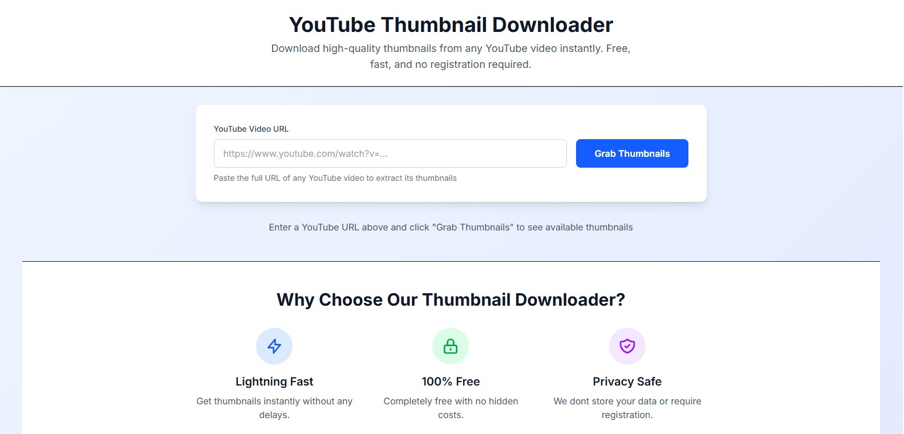

# YouTube Thumbnail Downloader

A simple open-source tool to download thumbnails from any YouTube video.

## Live Demo
https://yt-thumbnail-downloader-chi.vercel.app/

## Features
- Download thumbnails from YouTube videos
- Simple and fast
- Works directly in the browser
- No API required

## How It Works
1. Paste a YouTube video URL.
2. The app extracts the video ID.
3. It generates the thumbnail using YouTube’s thumbnail format.
4. Multiple sizes are avaiable to be download from.

Example:

## Tech Stack
- Next.js
- React
- JavaScript
- CSS

## Usage
1. Open the website.
2. Paste a YouTube video link.
3. Click the button to get the thumbnail.
4. Download the thumbnail.

## License
This project is open source and free to use.
